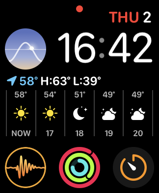
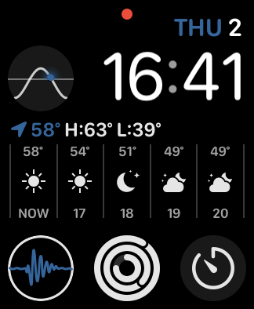

# Now Playing Shortcut

## What

It's literally just a small complication for the `Now Playing` View for your Apple Watch.

## Why

For some reason Now Playing doesn't have a small complication. True, it does have an icon at the top of your watch when you're listening to something, however if you want to quickly resume where you left off you need to open up your audio app to do that, while now playing can do that for you faster.

## How

WatchOS doesn't support something like `UIApplication.shared.open()` as far as I could tell, but it does let you embed a `Now Playing View` in your app, so that's all this app is.

### Development
`Sketch` should export all the relevant image sizes to the correct locations if you export to the root.

### Reference
* [Complication Image Sizes](https://developer.apple.com/design/human-interface-guidelines/watchos/icons-and-images/complication-images/)
* [Complication Types](https://developer.apple.com/design/human-interface-guidelines/watchos/app-architecture/complications/)